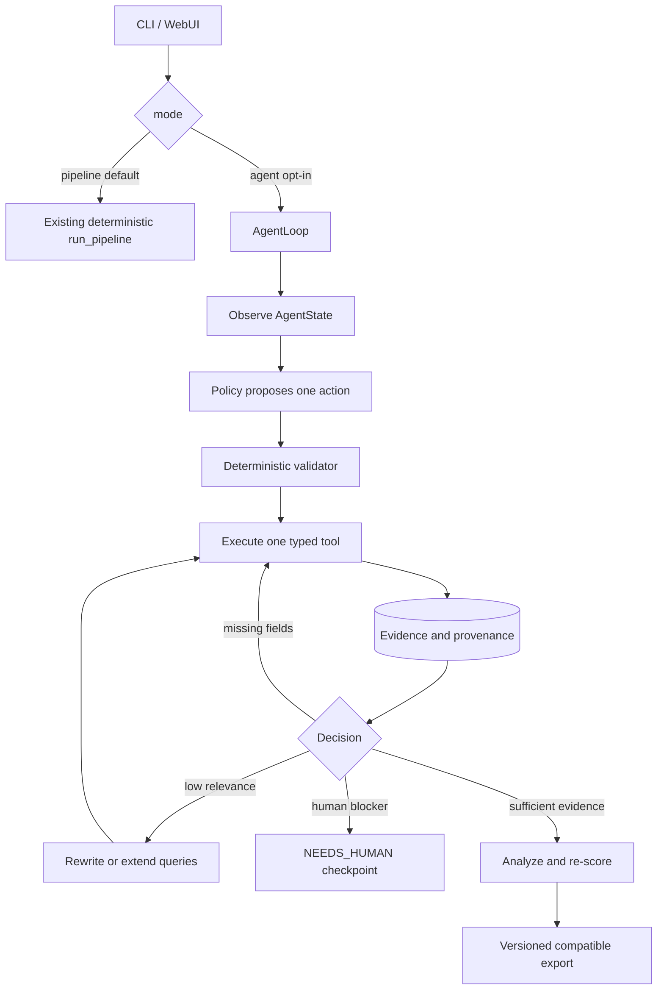
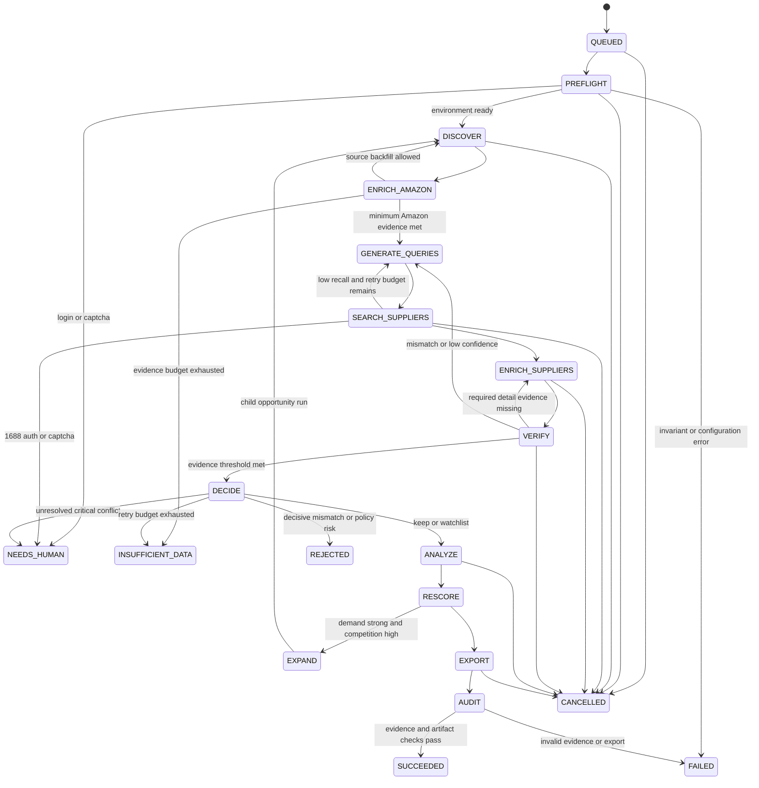

# Agentic Sourcing Loop Design

**Date:** 2026-07-10
**Status:** Approved design
**Scope:** Amazon US product discovery, Amazon-to-1688 matching, evidence-backed sourcing decisions, and compatibility with the existing seven-stage pipeline.

## 1. Objective

Upgrade Amazon Selector from a fixed pipeline wrapper into an observable, finite, evidence-driven sourcing loop without removing the existing CLI, SQLite database, exports, or deterministic seven-stage mode.

The first implementation delivers one complete vertical slice:

```text
Amazon structured understanding
→ multi-query Chinese supply-chain search
→ multiple 1688 supplier candidates
→ offer detail enrichment
→ structured attribute comparison
→ dual-image verification
→ bounded low-confidence retry
→ evidence-backed recommendation or rejection
```

The system must prefer an explicit `insufficient_data` or `needs_manual_review` result over a strong recommendation based on missing, inferred, stale, conflicting, or mock evidence.

## 2. Approved Architecture Decisions

1. Use an in-process finite state machine. Do not introduce Temporal, Prefect, LangGraph, or another external workflow service in the first implementation.
2. Create a canonical UUID `sourcing_run_id` for every new run. Preserve the legacy integer `RunLog.id` as an alias where one exists.
3. Preserve `python main.py run ...` behavior as deterministic linear mode by default. Agentic behavior is opt-in through `--mode agent`.
4. Fix Amazon marketplace to `US` in all new paths.
5. Keep formal runs no-mock. A mock supplier cannot enter the candidate pool, evidence chain, profit model, recommendation, or benchmark as a real supplier.
6. LLMs may propose structured actions or evidence, but a deterministic validator controls tool eligibility, budgets, state transitions, evidence thresholds, and recommendation status.
7. Keep current JSON, Excel, and Markdown fields compatible. New evidence is additive and versioned.
8. Do not infer reliable historical run relationships that the current database cannot prove. Such records are marked `legacy_unscoped`.

## 3. Audit Baseline and Safety Findings

The implementation is measured against the Phase 0 snapshot generated on 2026-07-10:

- 406 tests passed, 5 skipped.
- 60 Amazon products, 288 suppliers, 59 profit snapshots, 59 scores, and 15 market rows.
- Valid current market evidence: 0 of 60 products.
- Current local mock contamination: 0 percent.
- 30 of 47 RunLogs are marked success, but only 8 runs produced candidates.
- 22 of 30 successful RunLogs have zero candidates.
- A live no-mock Docker smoke run crawled zero products after repeated Amazon detail timeouts, yet its RunLog was marked success.
- Of 12 historical top-supplier decisions carrying LLM visual evidence, 8 had `is_match=false`; all 12 passed hard filters.
- All 288 persisted MOQ values equal 1 and all 288 price-tier lists contain one synthetic quantity-1 tier.
- All 59 competition scores equal 1.0 while valid market competition evidence is absent.

The following defects are release-blocking for agentic mode:

1. LLM mismatch confidence is used as positive match similarity.
2. Missing market data yields optimistic competition scores.
3. Missing purchase price can yield zero purchase cost.
4. Missing MOQ is silently represented as 1.
5. Detail extraction creates implausible but non-empty values from page-wide text.
6. A zero-product crawl can be recorded as a successful pipeline run.
7. Current records lack field-level provenance and reliable run scope.

## 4. Compatibility Architecture



`run_pipeline()` remains callable with its current signature and continues returning an integer RunLog ID. Agentic mode uses the same crawlers, matchers, analyzers, and exporters through typed wrappers, then gradually replaces internal fixed fallback decisions with explicit policy actions.

## 5. Finite State Machine

### 5.1 Run states



### 5.2 Product states

```text
DISCOVERED
→ AMAZON_ENRICHED
→ QUERY_PLANNED
→ SUPPLIERS_FOUND
→ SUPPLIERS_ENRICHED
→ VERIFIED
→ ANALYZED
→ SELECTED | WATCHLIST | NEEDS_MANUAL_REVIEW | REJECTED | INSUFFICIENT_DATA
```

Every transition records the prior state, next state, selected action, reason code, evidence references, policy version, budget delta, and tool call correlation ID.

## 6. AgentState

AgentState stores small, replayable control state and references to evidence. Raw HTML, images, and large API payloads remain artifacts addressed by hash.

Required fields:

```text
Identity
- sourcing_run_id
- legacy_run_log_id
- job_id
- parent_run_id
- policy_mode
- policy_version
- pipeline_version

Objective
- objective
- marketplace
- source_market
- source_mode
- original_query
- current_query
- category
- requested_limit
- top_n

Working evidence
- candidate_pool
- rejected_candidates
- product_evidence_refs
- supplier_evidence_refs
- query_attempt_refs
- missing_fields
- conflicts

Control
- phase
- status
- iteration
- retry_counts
- tool_history_refs
- pending_action
- no_progress_count
- checkpoint_seq

Budget
- max_steps
- deadline_at
- max_query_rewrites
- max_source_backfills
- max_supplier_retries
- max_llm_calls
- max_browser_calls
- total_cost

Termination
- stop_reason
- needs_human_reason
- resume_from
- result_refs
```

## 7. Evidence Model

### 7.1 FieldEvidence

Every sourcing-critical field is represented by a value plus evidence metadata:

```text
FieldEvidence[T]
- value: T | null
- status: verified | extracted | inferred | stale | missing | mock | conflicting
- source_provider
- source_type
- source_url_or_artifact_ref
- observed_at
- expires_at
- confidence
- extraction_method
- schema_version
- conflict_refs
```

Rules:

- `missing`, `mock`, and `conflicting` are never converted to zero, empty text, false, or a business-optimal default.
- `inferred` cannot satisfy a critical evidence threshold unless a policy explicitly allows it for manual-review output.
- `stale` evidence can be displayed but cannot support a strong recommendation.
- `verified` requires independent validation, not merely a non-empty value.
- Numeric offer identity does not make supplier fields verified.
- Record timestamps cannot substitute for field observation timestamps.

### 7.2 AmazonProductUnderstanding

Vision Task A and text extraction jointly produce schema-validated data:

```text
generic_product_name
supply_chain_name_cn
category
subcategory
function
material
components
package_quantity
dimensions_visible
target_user
use_case
replaceable_part_or_full_product
distinguishing_features
likely_supplier_keywords_cn
uncertainty
```

Inputs include the original English title, bullet points, structured attributes, main image, available secondary images, and explicit unknown fields. Brand terms are retained for risk analysis but excluded from supplier-copy queries.

### 7.3 QueryPlan

Each Amazon product produces query records for:

1. generic Chinese product name
2. Chinese supply-chain industry name
3. function
4. material
5. core structure
6. use scenario
7. specification
8. pack quantity
9. replacement or consumable relation
10. de-branded description
11. synonyms and factory terminology
12. likely 1688 category terminology

Every query stores its type, text, generation reason, excluded brand tokens, source evidence, search backend, results, hit count, relevant hit count, and retry lineage.

### 7.4 MatchEvidence

Every Amazon-product/supplier pair records:

```text
category_match
function_match
material_match
shape_match
dimension_match
weight_match
package_quantity_match
color_variant_match
accessory_vs_full_product_match
target_user_match
use_case_match
customization_feasibility
packaging_feasibility
image_similarity
title_semantic_similarity
specification_similarity
brand_dependency_risk
patent_risk
compliance_risk
overall_confidence
mismatch_reasons
missing_evidence
decision
```

Hard mismatch rules apply to different core function, accessory versus full product, incompatible pack quantity, brand-specific accessory versus generic product, and explicit critical specification conflict.

An LLM `confidence` measures confidence in its classification. It is never interpreted as similarity. `is_match=false` creates negative evidence and cannot increase a match score.

## 8. Minimum Evidence Thresholds

A supplier cannot receive `recommend` unless all of the following hold:

- real, non-mock offer identity and accessible detail evidence
- product type and core function agree
- accessory/full-product relation agrees
- pack quantity is matched or explicitly verified compatible
- purchase price and applicable quantity tier are extracted or verified
- MOQ is extracted or verified, not inferred from a default
- no unresolved critical spec conflict
- sufficient product/package weight and dimension evidence for the selected logistics model
- market demand and competition evidence are present and fresh
- visual verification is not negative
- overall confidence meets the configured threshold

If supplier evidence is adequate but market evidence is missing, the maximum status is `needs_manual_review` or `watchlist`. If supplier identity, function, price, or MOQ is missing, the status is `insufficient_data` or `reject`.

## 9. Typed Tool Contract

```text
ToolContext
- sourcing_run_id
- decision_id
- call_id
- idempotency_key
- deadline
- cancel_check

ToolResult[T]
- status: success | empty | partial | failed | interrupted
- data
- evidence_refs
- quality_metrics
- gaps
- error_code
- retryable
- sanitized_diagnostic
- cost
```

Error codes include:

```text
AUTH_REQUIRED
CAPTCHA
RATE_LIMITED
TIMEOUT
NO_RESULTS
LOW_RELEVANCE
MISSING_REQUIRED_DATA
SPEC_CONFLICT
POLICY_BLOCKED
INVALID_INPUT
UNAVAILABLE
INTERRUPTED
INTERNAL
```

Initial tools wrap existing capabilities. Later supplier matching is split into cache lookup, imported supplier lookup, each live backend, detail enrichment, structured verification, and visual verification.

## 10. Retry and Stop Policy

Initial bounded defaults:

- maximum two query rewrites per product
- maximum two Amazon source backfill rounds
- one normal backend attempt plus one retry only for transient failures
- maximum two low-confidence supplier-search iterations
- maximum three LLM action proposals per run
- identical action fingerprint may execute at most twice
- stop after two consecutive decisions add no entity, evidence, or quality improvement
- adjacent expansion is disabled by default
- when enabled, adjacent expansion creates one child run with at most three queries and twenty additional products
- captcha, login, or human-only compliance decisions immediately create `NEEDS_HUMAN`
- cancellation is checked before and after every tool call
- only idempotent unfinished tool calls can be automatically resumed

Terminal statuses:

```text
SUCCEEDED
COMPLETED_PARTIAL
COMPLETED_NO_CANDIDATES
INSUFFICIENT_DATA
NEEDS_HUMAN
FAILED
CANCELLED
```

## 11. Persistence and Migrations

The current `Base.metadata.create_all()` behavior is insufficient for schema upgrades. Add a small versioned SQLite migration runner before agentic tables are used.

Additive tables:

```text
schema_migrations
sourcing_runs
run_products
run_supplier_candidates
field_evidence
query_attempts
match_evidence
agent_decisions
agent_tool_calls
agent_artifacts
agent_checkpoints
feedback_labels
```

Add nullable `sourcing_run_id` references to profit, score, market, and run-event records. Product and Supplier remain catalog entities; exact per-run values live in run snapshot tables.

Migration sequence:

1. Run `PRAGMA integrity_check` and back up the database.
2. Create and stamp `schema_migrations`.
3. Create provenance and state tables without modifying old tables.
4. Create run-scoped product and supplier snapshot tables.
5. Add nullable run/correlation columns and indexes to existing snapshot/event tables.
6. Enable shadow dual-write while reads continue through the legacy path.
7. Verify candidate order, scores, rejection reasons, exports, and old API responses for parity.
8. Link only provable historical artifacts; mark all other history `legacy_unscoped`.
9. Switch Chat and run-detail reads to strict run-scoped repositories.
10. Enable SQLite foreign keys for new connections and add integrity tests.

No migration may overwrite or delete a historical product, supplier, profit, score, market row, export, or saved selection.

## 12. Exports and Recommendation Evidence

Existing export fields remain. Agentic exports add:

```text
schema_version
sourcing_run_id
legacy_run_log_id
config_hashes
model_and_prompt_versions
artifact_hashes
data_quality_summary
query_plan_and_hit_rates
match_evidence
recommendation_status
recommendation_reasons
rejection_reasons
manual_verification_tasks
```

Allowed recommendation statuses:

```text
recommend
watchlist
needs_manual_review
reject
insufficient_data
```

Every recommendation explains discovery reason, Amazon completeness, demand and competition evidence, supplier match evidence, confirmed and missing specifications, purchase-cost source, logistics assumptions, profit assumptions, risks, confidence, positive case, negative case, and required manual checks.

## 13. Benchmark and Feedback

The existing exports are seed material, not ground truth. No quality improvement claim is allowed until a reviewed benchmark exists.

Initial benchmark labels:

```text
match_label: compatible | mismatch | no_match | insufficient_evidence
recommendation_label: recommend | watchlist | needs_manual_review | reject
mismatch_types:
  function
  material
  dimension
  pack_quantity
  accessory_full_product
  brand_dependency
  target_user
  use_case
  compliance
```

The first seed set includes the current historical LLM top pairs, then adds correct matches, hard negatives, no-supplier cases, and missing-data cases. Images and raw artifacts are frozen by hash. The same ASIN or product family cannot cross benchmark train/calibration and evaluation partitions.

Required metrics:

```text
supplier_precision_at_1
supplier_precision_at_5
false_match_rate
no_match_accuracy
field_completeness
real_supplier_rate
mock_contamination_rate
recommendation_precision
manual_review_rate
cost_per_approved_candidate
average_retries
quality_pipeline_success_rate
```

Feedback from the WebUI is stored as versioned labels. It does not trigger online training.

## 14. Implementation Phases

### Phase 1: Data reliability and safety gates

- Fix mismatch confidence semantics.
- Eliminate optimistic defaults for missing critical fields.
- Add evidence contracts and additive migrations.
- Repair Amazon detail/buybox extraction.
- Repair 1688 detail, tier-price, MOQ, TMD, and provenance behavior.
- Restore valid market evidence and correct missing-data scoring.
- Persist real configuration snapshots and run lineage.

### Phase 2: Matching quality vertical slice

- Implement structured Amazon understanding.
- Generate the twelve query types.
- Persist query attempts and hit rates.
- Enrich multiple supplier details.
- Produce structured MatchEvidence.
- Implement schema-validated dual-image verification.
- Retry low-confidence matches within budget.
- Produce evidence-backed recommendation statuses.

### Phase 3: Agentic loop

- Add AgentState, FSM, policy, typed tools, checkpoints, resume, and decision logs.
- Preserve linear compatibility policy.
- Add deterministic enrich, retry, reject, expand, and re-score actions.

### Phase 4: Feedback loop

- Add WebUI labels for match, data, and recommendation correctness.
- Save labels into the benchmark store.
- Add replay and version comparison.

## 15. Verification and Acceptance

Every phase requires:

1. focused unit and integration tests
2. full `pytest tests/`
3. SQLite migration and integrity checks
4. a no-mock Docker smoke run
5. a field-completeness comparison against the Phase 0 artifact
6. benchmark metrics when ground-truth labels exist
7. reported mock contamination and unresolved issues

Agentic mode is not complete merely because code executes. It must show evidence that:

- critical missing fields do not enter scoring as optimistic defaults
- explicit mismatch cases are rejected
- no mock supplier enters formal candidates
- every decision is run-scoped and replayable
- quality metrics are computed from reviewed labels
- existing deterministic CLI and exports remain compatible

## 16. Expected File Boundaries

New files are expected under:

```text
agent/loop.py
agent/loop_state.py
agent/fsm.py
agent/policy.py
agent/tool_contracts.py
agent/provenance.py
agent/tools/
matchers/query_planner.py
matchers/match_evidence.py
schemas/sourcing.py
db/migrate.py
db/migrations/
benchmarks/
```

Existing modules are modified in place only where their current responsibility requires it: CLI mode routing, configuration, persistence, Amazon extraction, 1688 extraction, vision validation, matching, profit, market, scoring, AgentRuntime, Chat run scoping, and additive exports. WebUI changes remain in Phase 4 except for any minimal status compatibility needed earlier.
